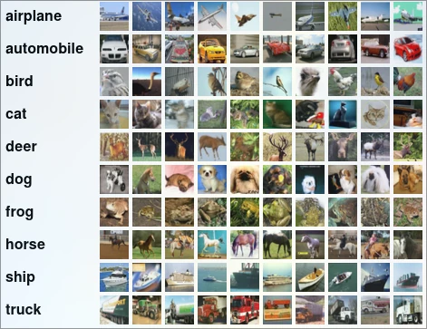
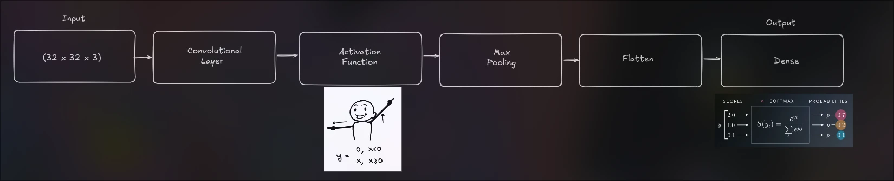

# TDSE-03 - CIFAR-10 Image Classification: Convolutional Neural Network

## Project Title
Convolutional Neural Network Implementation for CIFAR-10

## Problem Description
This project focuses on the implementation and understanding of **Convolutional Neural Networks (CNNs)** for image classification. The challenge is to classify small, low-resolution color images into one of 10 specific categories. Unlike traditional flat neural networks (Baseline), this project explores how preserving spatial structure through convolutions improves performance.

## Dataset Description
The dataset used is **CIFAR-10**, a standard benchmark in computer vision.

| Feature | Description |
| :--- | :--- |
| **Images** | 60,000 color images of 32x32 pixels (3 channels: RGB). |
| **Split** | 50,000 training images and 10,000 test images. |
| **Classes** | 10 mutually exclusive classes: *airplane, automobile, bird, cat, deer, dog, frog, horse, ship, truck*. |
| **Preprocessing** | Normalization (0-1 range) and One-Hot Encoding for target labels. |

## Architecture Diagrams
The architecture designed is simple but intentional to demonstrate the power of convolutions without excessive depth.

**Detailed Specification:**
1.  **Convolutional Layer**:
    *   **Filters**: 32
    *   **Kernel Size**: 3x3
    *   **Stride**: 1
    *   **Padding**: Same (maintains 32x32 spatial dim)
    *   **Activation**: ReLU (introduces non-linearity)
2.  **Pooling Layer**:
    *   **Type**: Max Pooling
    *   **Size**: 2x2
    *   **Stride**: 2 (Reduces dimension to 16x16)
3.  **Classification Head**:
    *   **Flatten**: Converts 3D volume to 1D vector.
    *   **Dense**: 10 units with **Softmax** activation for probability distribution.

## Experimental Results
We compared a Baseline Model (Fully Connected) against our CNN and explored hyperparameters.

### 1. Baseline vs. CNN
*   **Baseline Model** (Flatten + Dense Layers):
    *   Accuracy: 43.03%
    *   Observation: The geometry of the images is different, so a convolutional layer cannot capture the details.
*   **CNN Model** (Our Architecture):
    *   Accuracy: 62.85%
    *   Observation: Including this convolutional layer, allows the model to interpret patterns from different images; however, it is worth noting that we need more layers to improve this accuracy

### 2. Controlled Experiment: Kernel Size
We tested the effect of changing the kernel size while keeping other parameters fixed.

| Configuration | Kernel Size | Accuracy | Loss | Observations |
| :--- | :--- | :--- | :--- | :--- |
| **Experiment A** | **3x3** | 0.6239 | 1.1031 | Captures fine details and edges effectively. |
| **Experiment B** | **5x5** | 0.6285 | 1.0786 | *[Insert observation, e.g., May lose fine detail on small 32x32 images or result in blurrier feature maps]* |

## Interpretation

### Why did Convolutional Layers outperform the Baseline?

Due to feature extraction and the implementation of a pooling strategy that highlights the most relevants pixels, helping the model identify patterns.

### Inductive Bias

The importance of bias lies in the fact that if, after convolution, the values are close to zero and the activation function ReLu converts them to this value, it's possible to recover image features, such as an edge.

### When is Convolution NOT appropriate?

The types of problems where a convolution layer would not be appropriate are when the geometric shapes of the images are simple.

This will make it easier for the model to see that they have a similar pattern. This could be seen with a datset for classifying numbers where each image is the same size and they are centered, meaning their geometry does not change drastically.

## Deployment (SageMaker)
*[Space to describe your deployment steps or status]*
- Trained model exported as a tarball.
- Setup of inference entry point.
- Creation of SageMaker Endpoint (or attempt thereof).

## Built With
- **NumPy**: For the "From Scratch" implementation of convolution mathematics.
- **TensorFlow/Keras**: For efficient training and experimentation.
- **Matplotlib**: For visualization of data and feature maps.
- **Scikit-Learn**: For dataset splitting.

## Authors
- **Tulio Riaño Sánchez**

## References
- CIFAR-10 Dataset
- Deep Learning Specialization (Andrew Ng)
- CS231n: Convolutional Neural Networks for Visual Recognition

