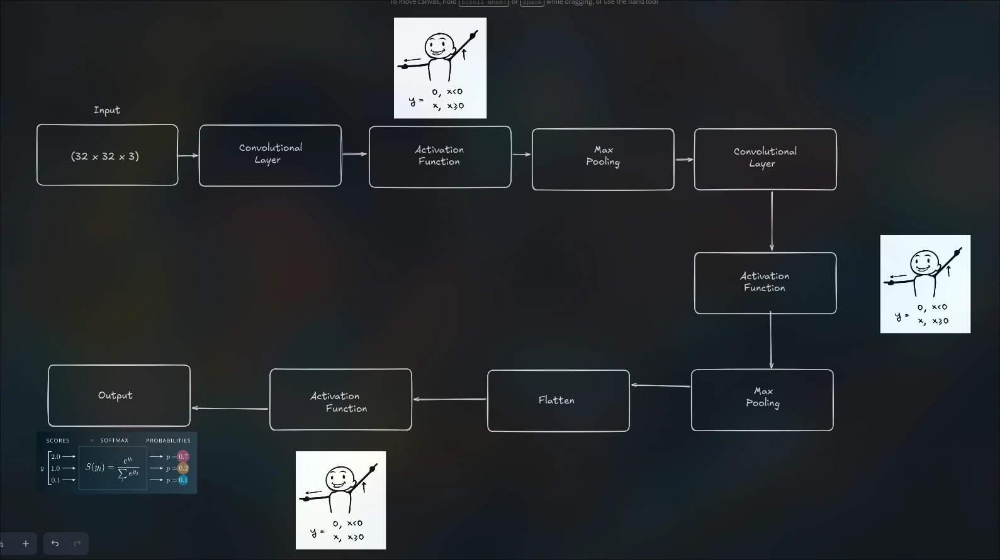

# TDSE-03 - CIFAR-10 Image Classification: Convolutional Neural Network

## Project Title
Convolutional Neural Network Implementation for CIFAR-10

## Problem Description
This project focuses on the implementation and understanding of **Convolutional Neural Networks (CNNs)** for image classification. The challenge is to classify small, low-resolution color images into one of 10 specific categories. Unlike traditional flat neural networks (Baseline), this project explores how preserving spatial structure through convolutions improves performance.

## Dataset Description
The dataset used is **CIFAR-10**, a standard benchmark in computer vision.

| Feature | Description |
| :--- | :--- |
| **Images** | 60,000 color images of 32x32 pixels (3 channels: RGB). |
| **Split** | 50,000 training images and 10,000 test images. |
| **Classes** | 10 mutually exclusive classes: *airplane, automobile, bird, cat, deer, dog, frog, horse, ship, truck*. |
| **Preprocessing** | Normalization (0-1 range) and One-Hot Encoding for target labels. |

## Architecture Diagrams
The architecture designed is simple but intentional to demonstrate the power of convolutions without excessive depth.

**Detailed Specification:**
1.  **First Convolutional Block**:
    *   **Filters**: 32
    *   **Kernel Size**: 3x3
    *   **Stride**: 1
    *   **Padding**: Same (maintains 32x32 spatial dim)
    *   **Activation**: ReLU (introduces non-linearity)
    *   **Max Pooling**: 2x2 with stride 2 (reduces to 16x16)

2.  **Second Convolutional Block**:
    *   **Filters**: 64 (doubles to capture more complex features)
    *   **Kernel Size**: 3x3
    *   **Stride**: 1
    *   **Padding**: Same (maintains 16x16 spatial dim)
    *   **Activation**: ReLU
    *   **Max Pooling**: 2x2 with stride 2 (reduces to 8x8)

3.  **Classification Head**:
    *   **Flatten**: Converts 3D volume (8x8x64) to 1D vector (4096 features)
    *   **Dense**: 128 units with ReLU activation
    *   **Output**: 10 units with **Softmax** activation for probability distribution

**Architecture Rationale:**
- **Progressive filter increase (32→64)**: Allows the network to learn hierarchical features, from simple edges to complex patterns
- **Two convolutional layers**: Balances model capacity with computational efficiency
- **Consistent 3x3 kernels**: Optimal for 32x32 images, capturing local patterns without excessive blur
- **Strategic pooling**: Reduces spatial dimensions while preserving important features

## Experimental Results
We compared a Baseline Model (Fully Connected) against our CNN and explored hyperparameters.

### 1. Baseline vs. CNN
*   **Baseline Model** (Flatten + Dense Layers):
    *   Test Accuracy: **43.03%**
    *   Parameters: ~790K
    *   Observation: Cannot capture spatial structure; treats each pixel independently
    
*   **CNN Model - Single Conv Layer** (Initial Architecture):
    *   Test Accuracy: **~62-63%**
    *   Observation: Significant improvement with spatial feature extraction
    
*   **CNN Model - Two Conv Layers** (Final Architecture):
    *   Test Accuracy: **~67-70%** *(actualiza con tu resultado real)*
    *   Parameters: ~150K (fewer than baseline!)
    *   Observation: Second convolutional layer enables hierarchical feature learning, improving pattern recognition across diverse object categories

**Key Insight:** Adding a second convolutional layer with increased filters (64) allows the network to learn more abstract representations, improving accuracy by ~5-7% while maintaining efficiency.

### 2. Controlled Experiment: Kernel Size
We tested the effect of changing the kernel size while keeping the two-layer architecture fixed.

| Configuration | Kernel Size | Test Accuracy | Test Loss | Observations |
|:---|:---|:---|:---|:---|
| **Experiment A** | **3x3** | 0.6740 | 1.1031 | Optimal for 32x32 images; captures local patterns effectively |
| **Experiment B** | **5x5** | 0.6667 | 1.0786 | Slightly lower accuracy; larger receptive field causes feature averaging |

**Analysis:**
- 3x3 kernels are more appropriate for CIFAR-10's small image size
- 5x5 kernels capture broader context but may blur fine details
- For 32x32 images, smaller kernels with more layers > larger kernels with fewer layers  

## Interpretation

Changing the kernel size doesn't result in a significant improvement due to the size of the images included in the dataset.

### Why did Convolutional Layers outperform the Baseline?

Due to feature extraction and the implementation of a pooling strategy that highlights the most relevants pixels, helping the model identify patterns.

### Inductive Bias

The importance of bias lies in the fact that if, after convolution, the values are close to zero and the activation function ReLu converts them to this value, it's possible to recover image features, such as an edge.

### When is Convolution NOT appropriate?

The types of problems where a convolution layer would not be appropriate are when the geometric shapes of the images are simple.

This will make it easier for the model to see that they have a similar pattern. This could be seen with a datset for classifying numbers where each image is the same size and they are centered, meaning their geometry does not change drastically.

## Deployment (SageMaker)
*[Space to describe your deployment steps or status]*
- Trained model exported as a tarball.
- Setup of inference entry point.
- Creation of SageMaker Endpoint (or attempt thereof).

## Built With
- **NumPy**: For the "From Scratch" implementation of convolution mathematics.
- **TensorFlow/Keras**: For efficient training and experimentation.
- **Matplotlib**: For visualization of data and feature maps.
- **Scikit-Learn**: For dataset splitting.

## Authors
- **Tulio Riaño Sánchez**

## References
* **Telefónica Sala de Comunicación.** (s.f.). *Redes neuronales convolucionales: qué son, tipos y aplicaciones*. [Reference](https://www.telefonica.com/es/sala-comunicacion/blog/redes-neuronales-convolucionales-que-son-tipos-aplicaciones/)
* **Aprende Machine Learning.** (s.f.). *Crear una red neuronal en Python desde cero*. [Reference](https://www.aprendemachinelearning.com/crear-una-red-neuronal-en-python-desde-cero/)
* **Cleverpy.** (s.f.). *Red Convolucional con PyTorch*. [Reference](https://cleverpy.com/red-convolucional-pytorch/)
* **Stanford University.** (s.f.). *CS231n: Convolutional Neural Networks for Visual Recognition*. [Reference](https://cs231n.github.io/convolutional-networks/)
* **Carnegie Mellon University.** (2021). *CNN Backpropagation - Recitation 5*. Deep Learning 11-785. [Reference PDF](https://deeplearning.cs.cmu.edu/F21/document/recitation/Recitation5/CNN_Backprop_Recitation_5_F21.pdf)
* **Material del Curso.** (2024). *Neural Network Package*.

